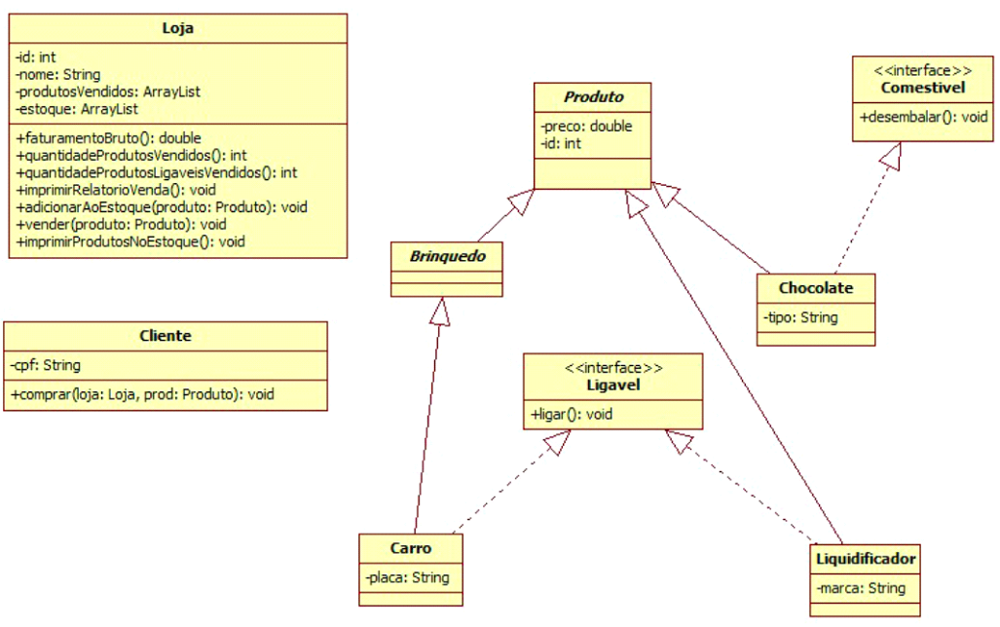

# Questão 2 (5,0)
 

### 1 -  Crie todas as classes e interfaces acima.

### 2 -  Crie os getters e setters que julgar necessário para o funcionamento do sistema.

### 3 -  Observe que Produto e Brinquedo são classes abstratas.

### 4 -  Implemente todos os métodos das classes do diagrama acima, de forma que funcionem de acordo com o nome que apresentam.

### 5 -  Em produto, adicione um contrutor que receba o preco e o id como argumentos. Não adicione outro construtor.

### 6 -  Respeite as assinaturas dos métodos.

### 7 -  Os métodos das entidades com retorno void devem seguir o padrão de aula, imprimindo no console “XXX fazendo alguma coisa”.

### 8 -  O método comprar da classe cliente deve chamar o método vender na loja específica em que quer comprar determinado produto.

### 9 -  O método faturamentoBruto deve retornar a soma dos preços dos produtos vendidos.

### 10 -  O método quantidadeProdutosVendidos deve retornar o número total de produtos vendidos.

### 11 -  O método quantidadeProdutosLigaveisVendidos deve retornar o número total de produtos Ligaveis vendidos.

### 12 -  O método imprimirRelatorioVenda deve imprimir o “id” e “preco” dos produtos vendidos junto com (se for carro, imprimir a placa – se for Liquidificador, imprimir a marca, se for chocolate, imprimir o tipo).

### 13 -  O método imprimirProdutosNoEstoque deve imprimir o “id” e “preco” dos produtos existentes no estoque junto com (se for carro, imprimir a placa – se for Liquidificador, imprimir a marca, se for chocolate, imprimir o tipo). *Cuide para que todas as classes acima compilem sem problemas. 

### 14 -  O método vender da classe loja deve remover o produto do estoque e adicionar a lista aos produtos vendidos. Considere que ArrayList possui o método remove(int i) que remove o elemento do índice i e retorna o elemento removido.

### 15 -  Crie uma classe com o método main. 
*Sempre atribua valores aos atributos de instância de todos os objetos que criar.*
 
1. Crie uma loja nova.
2. Crie um carro, um liquidificador e um chocolate. Adicione ao estoque da loja.
3. Crie um objeto do tipo cliente.
4. Faça esse cliente comprar o carro e o chocolate da loja criada.
5. Imprima o faturamento bruto da loja.
6. Imprima a quantidade de produtos vendidos.
7. Imprima a quantidade de produtos ligaveis vendidos.
8. Imprima o relatório de venda.
9. Imprima os produtos existentes no estoque.
